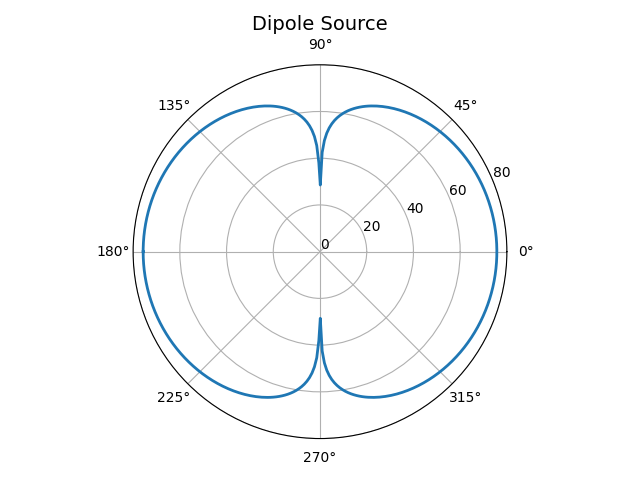

<h1> Acoustic Sources Modeling </h1>

Project that graphically represents the radiation pattern of acoustic sources.

<h2> Table of Contents</h2>

- [Intro](#intro)
- [Install](#install)
- [Dipole Source](#dipole-source)

## Intro

## Install

- Create virtual environment at project root directory

  `python3 -m venv .venv`

- Activate virtual environment

  `source .venv/bin/activate`

- Install dependencies

  `pip install -r requirements.txt`

- Run main script

  `python3 main.py`

## Dipole Source

