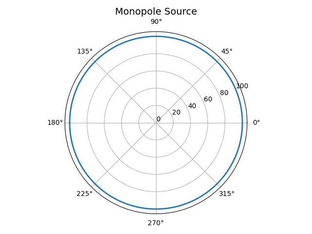
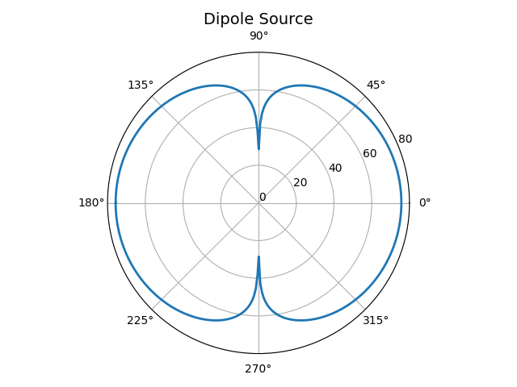
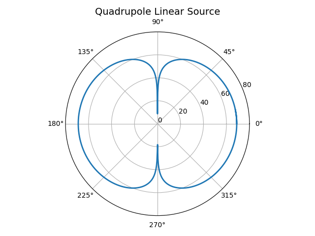
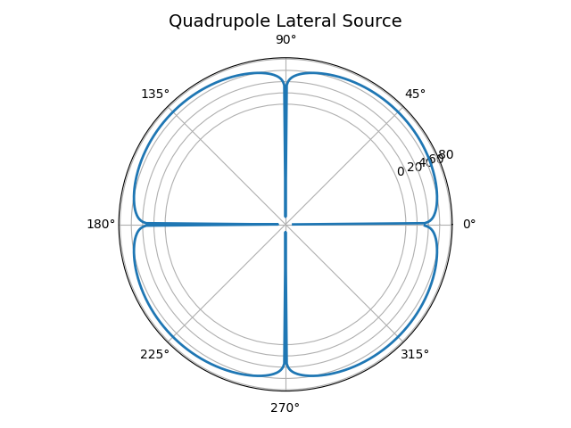

<h1> Acoustic Sources Modeling </h1>

Project for modeling and visualizing the radiation patterns and directivity of fundamental acoustic sources using Python.

The project models classical acoustic multipole sources such as monopoles, dipoles, and quadrupoles, illustrating their sound radiation characteristics and cancellation regions.

<h2> Table of Contents</h2>

- [Intro](#intro)
- [Install](#install)
- [Acoustic Sources Theory](#acoustic-sources-theory)
  - [Monopole Source](#monopole-source)
  - [Dipole Source](#dipole-source)
  - [Quadrupole Linear Source](#quadrupole-linear-source)
  - [Quadrupole Lateral Source](#quadrupole-lateral-source)
- [References](#references)

# Intro

This project was developed to study and visualize the radiation patterns of elementary acoustic sources.

The generated figures illustrate how sound pressure is radiated spatially by different source configurations, highlighting regions of constructive radiation and destructive interference.

The implemented models are based on classical acoustic theory and multipole source approximations.

# Install

- Create virtual environment at project root directory

  `python3 -m venv .venv`

- Activate virtual environment

  `source .venv/bin/activate`

- Install dependencies

  `pip install -r requirements.txt`

- Run main script

  `python3 main.py`

# Acoustic Sources Theory

## Monopole Source

The monopole source is the most elementary sound source.

It is a spherical source whose radius is small compared to the generated wavelength. It is also known as a point source or simple source.

The monopole creates a sound wave by alternately introducing and removing fluid from the surrounding area while radiating with equal intensity in all directions, as shown in the generated figure.

An example of this type of source is a loudspeaker radiating low-frequency sound.

## Dipole Source

A dipole source is composed of two monopole sources with equal strength (pressure/intensity), but with opposite phases and separated by a very small distance compared to the emitted wavelength.

While one source expands, the other contracts the surrounding air volume.

A dipole source does not radiate sound equally in all directions. Its directivity pattern resembles the shape of a figure-eight, meaning there are two regions where sound is efficiently radiated and two regions where sound is canceled.

A sphere oscillating back and forth behaves as a dipole source, as illustrated in the generated figure.

## Quadrupole Linear Source

A linear quadrupole is formed by four monopoles with alternating phases, or by two dipoles aligned along the same radiation axis.

This configuration causes efficient radiation in front of each monopole while producing cancellation at points equidistant from adjacent monopoles, as illustrated in the generated figure.

## Quadrupole Lateral Source

A lateral quadrupole is also formed by four monopoles or two dipoles with alternating phases, but they are not aligned along the same radiation axis.

The radiation pattern presents similarities to that of the linear quadrupole, but cancellation occurs at points equidistant from adjacent monopoles, as shown in the generated figure.

# References

- Beranek, L. L. _Acoustics_. Acoustical Society of America, 1996.

- Bies, D. A.; Hansen, C. H.; Howard, C. Q. _Engineering Noise Control: Theory and Practice_. CRC Press, 2017.

- Gómez Acosta, J. J. _Projeto e Desenvolvimento de um Sonômetro de Baixo Custo_. Master's Dissertation, Pontifícia Universidade Católica do Rio de Janeiro (PUC-Rio), 2023. [Available online](https://www.maxwell.vrac.puc-rio.br/colecao.php?strSecao=resultado&nrSeq=67341&idi1=&rc=1).
